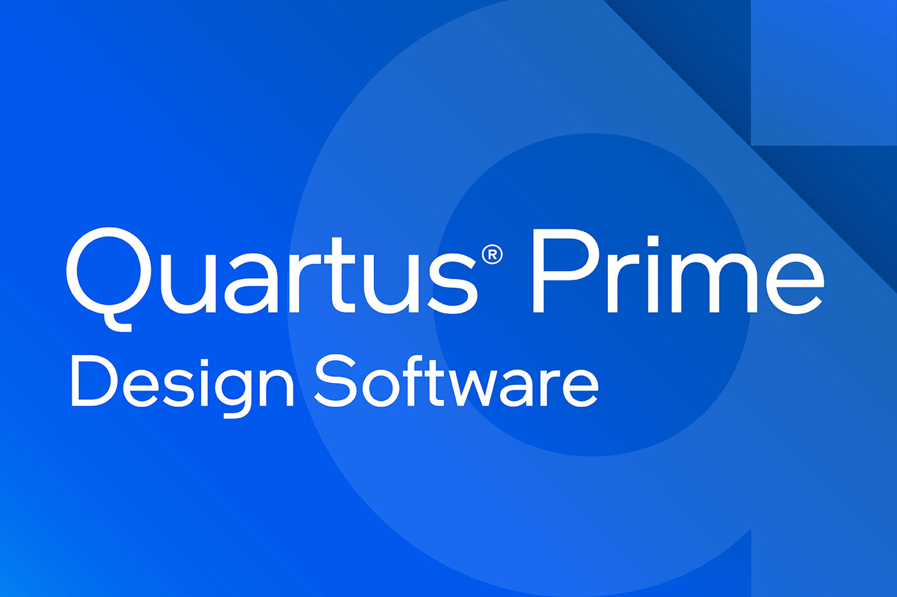
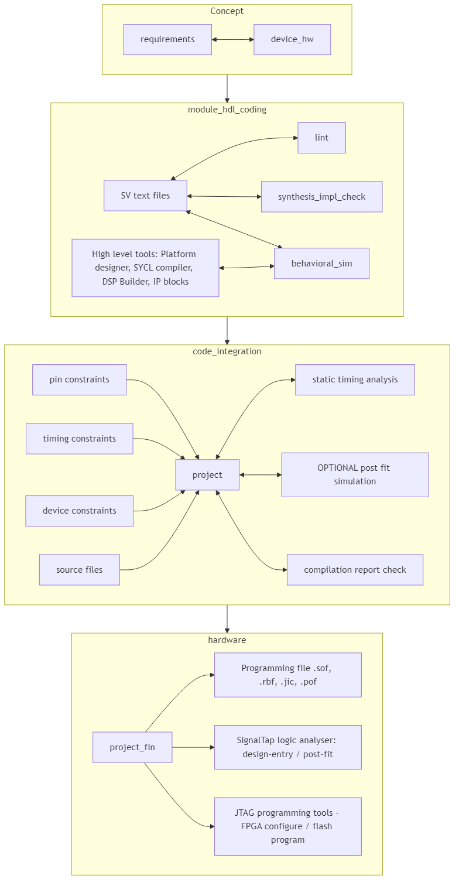
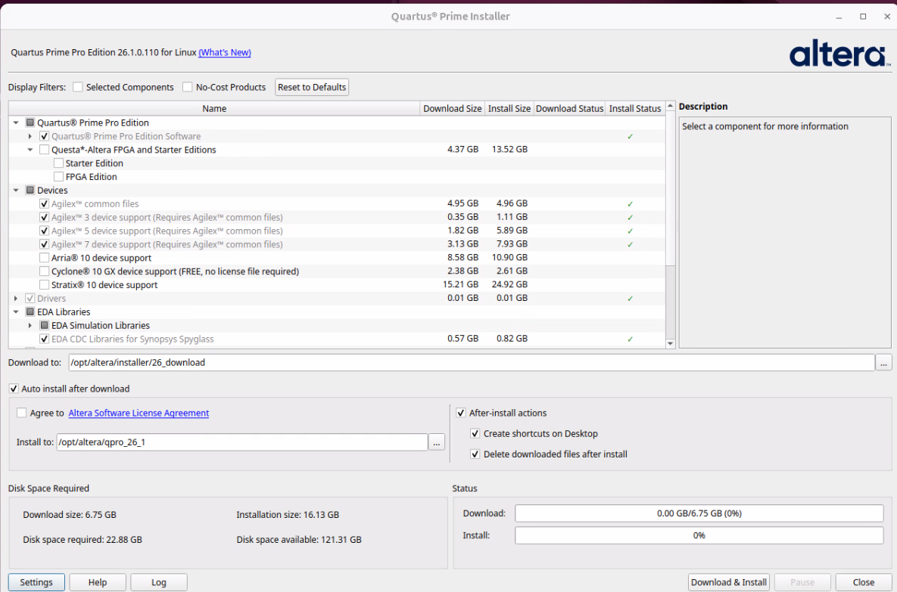
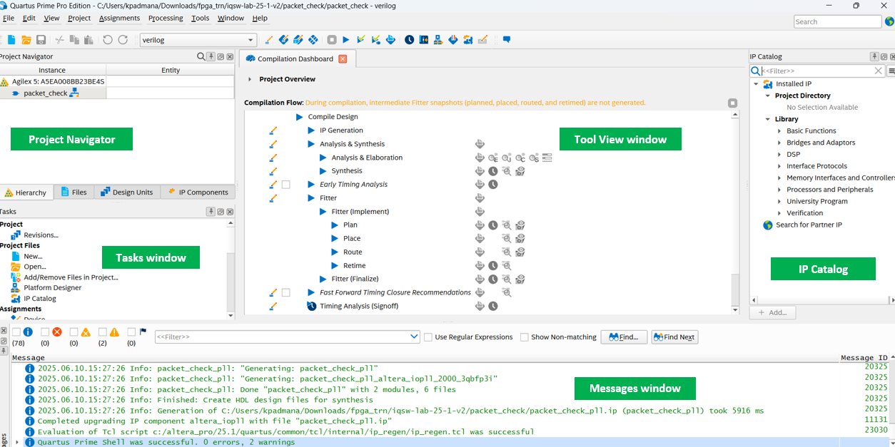

# 1. Quartus Prime Pro project management

---

## Agenda

Tips for project organization outside of the Quartus Prime Pro software

1. Quartus Prime Pro GUI
2. Quartus Prime Pro compilation flow
3. Source files and directives
4. Artifact organization and naming
5. Settings files and settings editors

::: notes

Quartus Prime Pro is the EDA software for targeting current Altera devices

- Arria 10
- Cyclone 10 GX
- Stratix 10
- All Agilex families

Quartus Prime Standard is used for older families including:

- Cyclone / Arria / Stratix / MAX families other than those above

This training will only cover Quartus Prime Pro software.

This training also assumes that Quartus Prime Pro software is already installed on your computer.

:::

---

## FPGA design flow

{width=30%}

::: notes

These are the high level activities in designing and deploying an FPGA.  Depending on the size of the project, you might choose to design some modules in isolation first and integrate later.

Quartus Prime Pro software provides

:::

---

## Outside Quartus Prime Pro software

- Version control 
- CI/CD services (cloud or on-prem)
  - [github](https://github.com/) 
  - [gitlab ](https://gitlab.com/) 
- CI/CD 
  - [jenkins](https://www.jenkins.io/) 
- Others
  - [FuseSoc](https://fusesoc.readthedocs.io/en/stable/index.html)

::: notes

The Software does not provide any integration with version control or CI/CD functions, though does not preclude their use.  I will cover some good ways to work to make separation of source and artifacts easier for CI/CD / .gitignore files

:::

---

## Installation

- Check [operating system and hardware requirements](https://www.altera.com/design/guidance/software/os-support)
- Download installer from [download page](https://www.altera.com/downloads/fpga-development-tools/quartus-prime-pro-edition-design-software-version-26-1-windows)
  - Version and operating system can be selcted using drop down menus: 
  - Quartus Prime Installer allow the files required to be configured prior to download and installation
- Installation
  - cmd line only available - especially suitable for headless and Dockerfile.  An example that builds a docker image is provided [here](https://github.com/gavin5342/altera_example/blob/main/questa_docker/README.md)
  - GUI shows you which components are available.  It's easy to update your installation later if you need to add families or features
    {width=40%}

---

# Exploring the software through the GUI

- Demo

::: notes

This section is intended to be live demo in the session.

Cover each part of 

- toolbar
- menus
- tools -> Customize...
- right lick tools for large icons
- unpin / pin
- dock / undock
- Go through the menus
- Look in Settings and Device menus
- Add an assignment and see the effect in the tcl console

:::

---

## Comparison to other tools

#### File names

| Quartus file extension | usage                                     | other tools equivalent |
| ---------------------- | ----------------------------------------- | ---------------------- |
| .qpf                   | Project file                              | .ldf .xpr              |
| .qsf                   | Settings file                             | .lpf .xdc              |
| .qip                   | Quartus IP file - a group of source files |                        |
| .ip                    | Quartus IP file (IP-XACT)                 | .xml                   |
| .stp                   | SignalTap (logic analyser) file           | .rvl .ltx              |
| .qsys                  |                                           |                        |

### Setting names

- **Assignments -> Settings**

  **Compiler Settings -> Advanced Settings**

| Quartus setting               | usage                                | other tools equivalent |
| ----------------------------- | ------------------------------------ | ---------------------- |
| Fitter Initial Placement Seed | Affects randomized initial placement | cost table             |

---

## Scripted flow

- The GUI is good for getting started and exploring what's possible.
- It's more reliable to compile from a script for production
- Recompiling a design with unchanged sources on the same compute architecture will produce the same artifacts
  - Changing any source file will change (even non-functional changes like port list order)
  - Change Fitter Initial Placement seed to deliberately change initial placement and change artifact
  - Change in operating system (eg Windows -> Ubuntu) could change result
- **Recommendation** as your design gets ready for integration, define a CI job and use docker to ensure software versions and OS/OS settings can be used.  Altera builds docker images for the Quartus software available from [docker hub](https://hub.docker.com/u/alterafpga)
  - You may also want to build your own.  A starter guide is provided [here](https://github.com/gavin5342/altera_example/tree/main/questa_docker)

