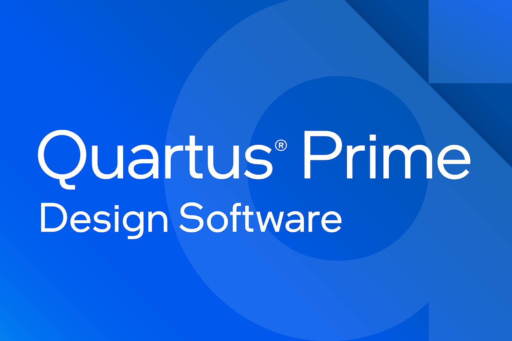
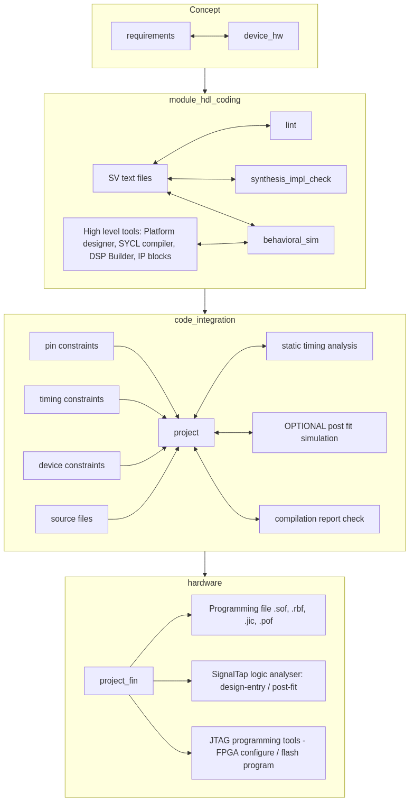
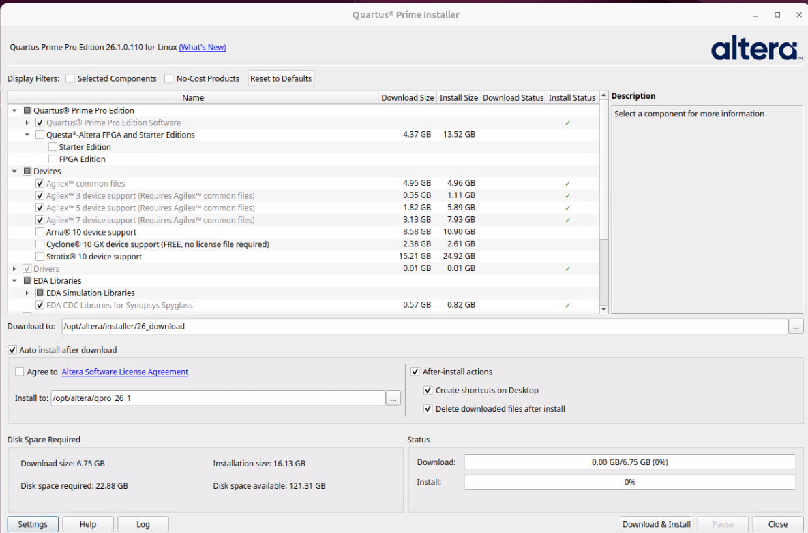
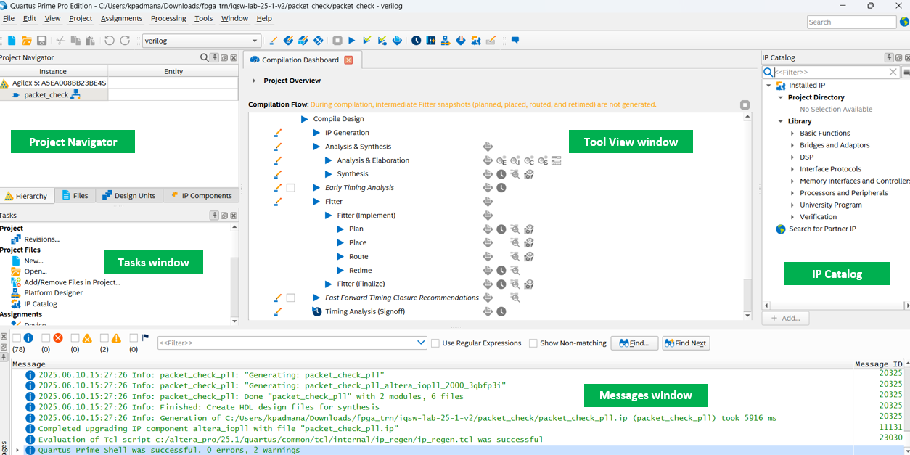
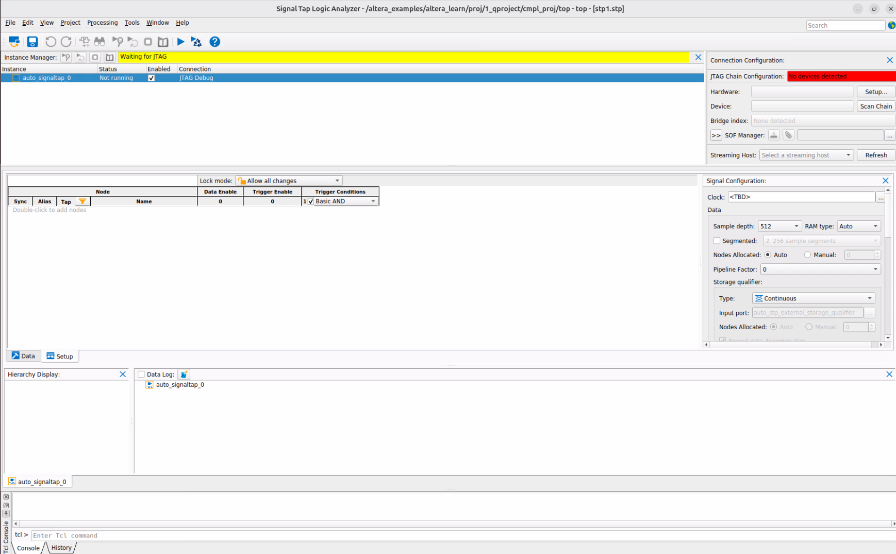

# 1. Quartus Prime Pro project management

---

## Agenda

Tips for project organization outside of the Quartus Prime Pro software

1. Quartus Prime Pro GUI
2. Quartus Prime Pro compilation flow
3. Source files and directives
4. Artifact organization and naming
5. Settings files and settings editors

::: notes

Quartus Prime Pro is the EDA software for targeting current Altera devices

- Arria 10
- Cyclone 10 GX
- Stratix 10
- All Agilex families

Quartus Prime Standard is used for older families including:

- Cyclone / Arria / Stratix / MAX families other than those above

This training will only cover Quartus Prime Pro software.

This training also assumes that Quartus Prime Pro software is already installed on your computer.

:::

---

## FPGA design flow

{width=30%}

::: notes

These are the high level activities in designing and deploying an FPGA.  Depending on the size of the project, you might choose to design some modules in isolation first and integrate later.

Quartus Prime Pro software provides

:::

---

## Outside Quartus Prime Pro software

- Version control {width=20%}
- CI/CD services (cloud or on-prem)
  - [github](https://github.com/){width=10%}  [gitlab ](https://gitlab.com/){width=10%} 
- CI/CD 
  - [jenkins](https://www.jenkins.io/) {width=10%}
- Others
  - [FuseSoc](https://fusesoc.readthedocs.io/en/stable/index.html)

::: notes

The Software does not provide any integration with version control or CI/CD functions, though does not preclude their use.  I will cover some good ways to work to make separation of source and artifacts easier for CI/CD / .gitignore files through the day

:::

---

## Installation

- Check [operating system and hardware requirements](https://www.altera.com/design/guidance/software/os-support)
- Download installer from [download page](https://www.altera.com/downloads/fpga-development-tools/quartus-prime-pro-edition-design-software-version-26-1-windows)
  - Version and operating system can be selcted using drop down menus: 
  - Quartus Prime Installer allow the files required to be configured prior to download and installation

::: columns

::: column

- Installation
  - cmd line only available - especially suitable for headless and Dockerfile.  
  - GUI shows you which components are available.  
  - Installation may be updated later - don't worry about missing components

  

:::

::: column

{width=80%}

:::

:::

::: notes

An example that builds a docker image is provided [here](https://github.com/gavin5342/altera_example/blob/main/questa_docker/README.md)

:::

---

# Exploring the software through the GUI

- Demo

::: notes

This section is intended to be live demo in the session.

Cover each part of 

- toolbar
- menus
- tools -> Customize...
- right lick tools for large icons
- unpin / pin
- dock / undock
- Go through the menus
- Look in Settings and Device menus
- Add an assignment and see the effect in the tcl console

:::

---

## Comparison to other tools

#### File names

| Quartus file extension | usage                                     | other tools equivalent |
| ---------------------- | ----------------------------------------- | ---------------------- |
| .qpf                   | Project file                              | .ldf .xpr              |
| .qsf                   | Settings file                             | .lpf .xdc              |
| .qip                   | Quartus IP file - a group of source files |                        |
| .ip                    | Quartus IP file (IP-XACT)                 | .xml                   |
| .stp                   | SignalTap (logic analyser) file           | .rvl .ltx              |
| .vds                   | Visual Designer Studio system (IP-XACT)   | .xml                   |

### Setting names

- **Assignments -> Settings**

  **Compiler Settings -> Advanced Settings**

| Quartus setting               | usage                                | other tools equivalent |
| ----------------------------- | ------------------------------------ | ---------------------- |
| Fitter Initial Placement Seed | Affects randomized initial placement | cost table             |

---

## Scripted flow

- The GUI is good for getting started and exploring what's possible.
- It's more reliable to compile from a script for production
- Recompiling a design with unchanged sources on the same compute architecture will produce the same artifacts
  - Changing any source file will change (even non-functional changes like port list order)
  - Change Fitter Initial Placement seed to deliberately change initial placement and change artifact
  - Change in operating system (eg Windows -> Ubuntu) could change result
- **Recommendation** as your design gets ready for integration, define a CI job and use docker to ensure software versions and OS/OS settings can be used.  Altera builds docker images for the Quartus software available from [docker hub](https://hub.docker.com/u/alterafpga)
  - You may also want to build your own.  A starter guide is provided [here](https://github.com/gavin5342/altera_example/tree/main/questa_docker)

---

## Scripted flow pt 2

- Consider .qsys and .ip files source files.  The generated hdl does _not_ need to be checked in.
- `ip-generate` used to generate `.ip` files
  - Not required if Quartus compile flow is run first. Required if you want to run simulation first or in parallel with Quartus compilation
- `qsys-generate` used to generate `.qsys` files
  - Not required if Quartus compile flow is run first. Required if you want to run simulation first or in parallel with Quartus compilation
- Both hdl generation tools like to generate in-place which is awkward for version control.  My suggestion is to use a generated folder with symbolic links
- When all hdl is generated, compile using `quartus_sh --flow compile <project>`

---

## Levels of preservation

- Design Partitions allow you to freeze part of your design by the hierarchy that you define in your design entry.
- Design Partitions may be constrained to an area of the FPGA using LogicLock regions
- The Signal Tap Logic Analyzer may use Design Partitions to preserve all fitter results and then add the Signal Tap analyzer
- Design Partitions and LogicLock regions are the foundation of Partial Reconfiguration where part of a design may be reconfigured (eg change protocol for attached HSSI transceiver)
- Design partitions may be exported as `.qdb` files.  A `.qdb` can be included in a project as a source file
- Initial content of RAM may be modified without changing fitter placement and routing by using **Update Memory Initialization File** option

---

## Programming files

The assembler produces a `.sof` (Software object file) - this file can be used with the Altera programmer to program the FPGA through the JTAG interface.

The **File -> Programming File Generator** or `quartus_pfg` can be used to make files in other formats:

- `.rbf` (raw binary file) is a flat binary file intended for use with an external master to send configuration data to the FPGA.
- `.rpd` (raw programming data) is a flat binary file used to program a QSPI flash for Active Serial configuration using an external programmer
- `.jic` (JTAG indirect configuration) is a file used with Quartus programmer to program a QSPI flash using JTAG and a JTAG-QSPI bridge in the FPGA
- `.pof` (Programmer object file) is used to program a flash when the pins are directly connected to the Altera programming file
- `.hexout`[Intel HEX](https://developer.arm.com/documentation/101655/0961/OHX51-User-s-Guide/Intel-HEX-File-Format) format text file

---

## Debug tools

- Configuration and JTAG chain debug 

- FPGA JTAG based tools

  - Signal Tap Logic Analyzer 
  - In-System Memory Content Editor 
  - System Console 
    - Transceiver toolkit
    - External Memory Interface Toolkit

  

::: notes

You need to have your FPGA correctly configured and to be able to use the JTAG port to be able to go any further, so we provide tools to check the JTAG electrical connections and to communicate with the Secure Device Manager which controls access, authentication and encryption.  It is possible to configure fuses so that the debug ports are irreversibly disabled and only signed images are accepted.

There are a suite of tools that communicate through the JTAG port using the two USER registers available on the device.

Signal Tap Logic analyzer is n logic analyzer constructed in the FPGA.

System Console is used to (from the start splash):

    * To read or write Avalon Memory-Mapped (Avalon-MM) slaves using special
      masters
    * To sample the Platform Designer system clock and system reset signal
    * To run JTAG loopback tests to analyze board noise problems
    * To shift arbitrary instruction register and data register values to
      instantiated system level debug (SLD) nodes
    * To source and probe signals connected to In-System Sources and Probes
      (ISSP) nodes

:::

---

## Signal Tap

::: notes

- Connection Configuration - Runtime only: similar to programmer and quartus_pgm - select programming cable, then device on the JTAG chain to use.  Optionally program a .sof
- Signal configuration
  - Clock: Only one clock is allowed for trigger and capture.  When sampling non-synchronous signals or just signals with tight timing requirements, it might make sense to set_false_path
  - Data - configure depth and type of capture memory
  - Storage qualifier - if you use one of these you can disable the qualifier at runtime to return to continuous capture
  - Trigger - these are horizontal controls
    - I don't normally use state based trigger - I find it easier to write my trigger in Verilog and connect it here
    - You can have multiple triggers - but they each consume logic.
  - Setup tab
    - Lock mode trigger only restricts changes to runtime changes
    - Double click whit space for Node Finder
  - Data log - save run time results in the .stp file.  Tick the check box to save every trigger.  

:::