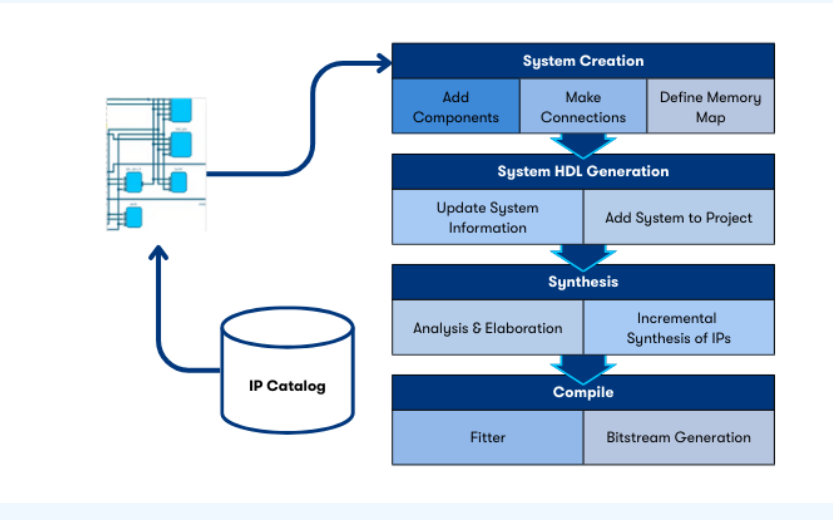

# Visual Designer Studio

---

# Supported interfaces

- Altera [Avalon](https://docs.altera.com/r/docs/683091/current) (AXI like)
  - Memory mapped
  - streaming
- ARM AMBA AXI
  - AXI3
  - AXI4
  - AXI4Lite
  - AXI4Stream
  - AXI4NoC
  - AXI5
- Conduit
  - directly exported, no interaction with connectivity
- Clock
  - Specify frequency
  - AXI and Avalon interfaces have associated clock (used to introduce clock crossing where required)
- Reset
  - has associated clock
  - AXI and Avalon interfaces have associated reset (used to introduce reset synchronisation where required)
- Interrupt

---

## Interconnect generation

- Memory mapped interconnect
  - Any master to any slave
  - interface adaptation inferred
    - associated clock and reset
  - Option to explicitly insert components recommended
    - clock crossing bridge
    - width adaption
    - burst adaption
  - Variable pipelining at system level to trade latency vs frequency
- Streaming
  - Any master to any slave

---

## Software integration

