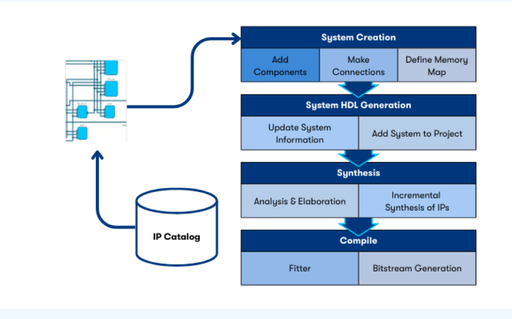
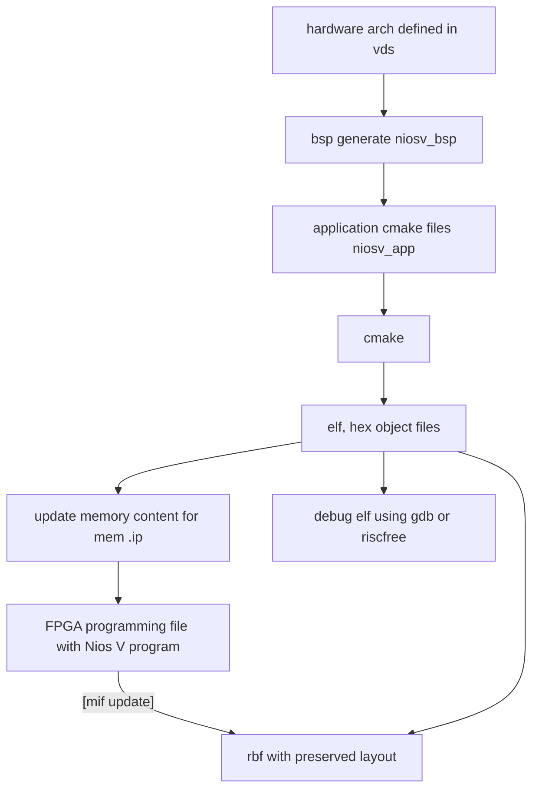
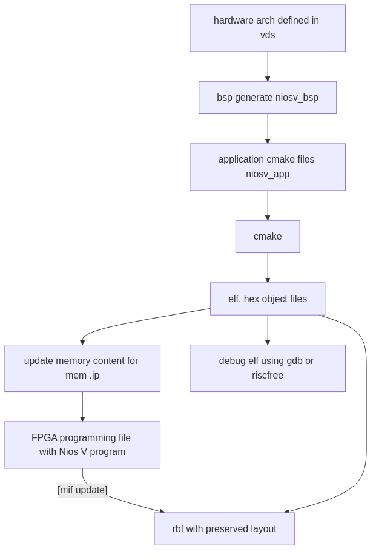

# Visual Designer Studio

---

# Supported interfaces

::: columns

::: column

- Altera [Avalon](https://docs.altera.com/r/docs/683091/current) (AXI like)
  - Memory mapped
  - streaming
- ARM AMBA AXI
  - AXI3
  - AXI4
  - AXI4Lite
  - AXI4Stream
  - AXI4NoC
  - AXI5

:::

::: column

- Conduit
  - directly exported, no interaction with connectivity
- Clock
  - Specify frequency
  - AXI and Avalon interfaces have associated clock (used to introduce clock crossing where required)
- Reset
  - has associated clock
  - AXI and Avalon interfaces have associated reset (used to introduce reset synchronisation where required)
- Interrupt

:::

:::

---

## Interconnect generation

- Memory mapped interconnect
  - Any master to any slave
  - interface adaptation inferred
    - associated clock and reset
  - Option to explicitly insert components recommended
    - clock crossing bridge
    - width adaption
    - burst adaption
  - Variable pipelining at system level to trade latency vs frequency
- Streaming
  - Any master to any slave

---

## Software integration

::: notes

The columns renders left to right in the reveal.js generated by pandoc

```mermaid
graph TB
	hw[hardware arch defined in vds] --> bsp[bsp generate niosv_bsp]
	bsp --> app[application cmake files niosv_app]
	app --> cmake
	cmake --> bin[elf, hex object files]
	bin --> hw_c[update memory content for mem .ip]
	hw_c --> rbf[FPGA programming file with Nios V program]
	bin --> dbg[debug elf using gdb or riscfree]
	rbf --[mif update]-->rbf2[rbf with preserved layout]
	bin --> rbf2
```

:::

::: columns

::: column

- BSP editor `niosv-bsp` and application template editor `niosv-app` available as cmd line applications or GUI for BSP editor.
  - Generates cmake based build files
  - Optional RiscFree IDE available

:::

::: column

:::

:::

---

## Tour of the tool

::: notes

Better to do this part live, but cover

- IP catalog
  - Same view as you see in the Quartus Prime Pro window
- Canvas view - how to connect up
  - We cover more in the lab
- Connectivity Designer
  - Alternate to the canvas - looks like SOPC Builder and Platform Designer to people who have used those before.
- Address Map Viewer
- Interrupt Editor
- Subordinate Arbitration Editor
- Netlist Navigator / Connections window
- Property Window
- Domains window
  - Look at how interconnect constraints can be defined 

:::
