# Agilex hardware + optimization

---

## Terminology

| Term      | detail                                                     | equivalent in other FPGAs |
| --------- | ---------------------------------------------------------- | ------------------------- |
| core      | logic, RAM and DSP                                         | Logic resources, fabric   |
| periphery | IO, transceiver, PLL                                       |                           |
| ALM       | variable input LUT + registers                             | SLICE, LE, PFU            |
| ALUT      | LUT part of ALM                                            | LUT                       |
| LAB       | collection of ALMs + routing                               | CLB                       |
| M20K      | block RAM                                                  | BRAM / URAM, EBR          |
| MLAB      | small RAM made from a LAB                                  | SLICEM                    |
| DSP block | hard block for fixed/floating point/complex multiplication | DSP48                     |

---

## ALM

::: columns

::: column

- configurable LUT
  - combinations of 8 input signals to 4+4; 5+3; 5+4; 5+5; single 6 input LUT
  - 8 input LUT extended mode - not all functions are supported.  Multiplexers preferred.
  - Adder with LUT combinations above
- 4 registers
- Differences/implications from other families
  - Can pack 4-wide input functions per reg or pair of reg (Logic Element like)
  - If everything were 6-input LUT optimised, ALUT vs reg resource usage may not follow

:::

::: column

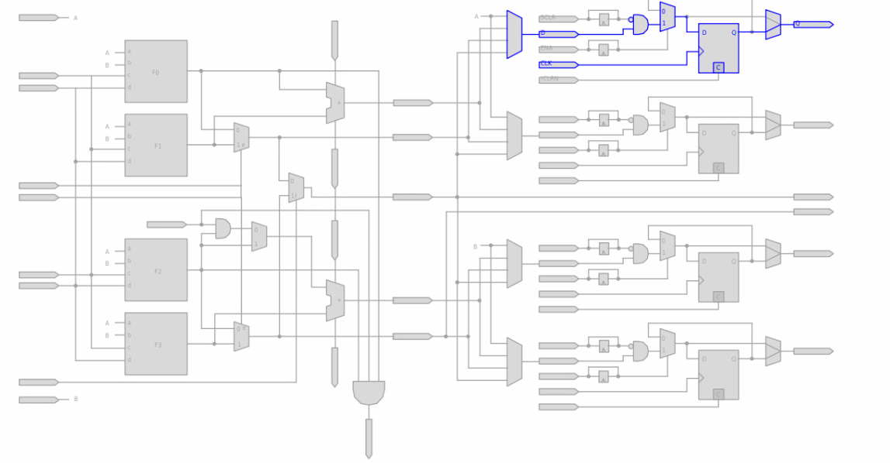

:::

:::

::: notes

The nuances of LUT widths and equations matters for logic that you _really_ want to optimise.  If you are in this mode of working, you probably want to check at regular intervals using the technology map viewer + resource property editor that your synthesis results match your intent.

:::

---

## LAB

::: columns

::: column

- block of 10 ALMs
- LAB wide ctrl signals
  - 2x clk
  - 2x clk_ph (delayed clocks)
  - 2x clr (async)
  - 2x clkena
  - 1x synclr
- May be reconfigured as MLAB = 640b arranged as 32x20

:::

::: column

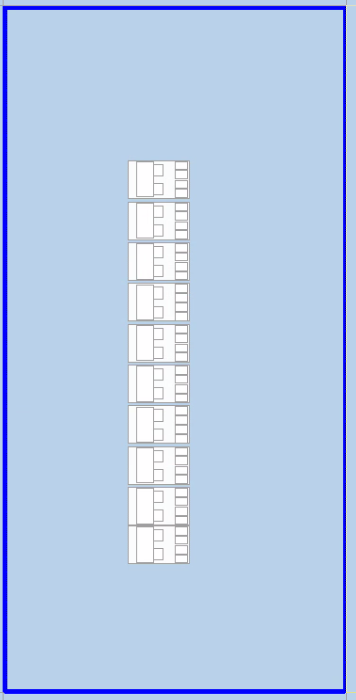{width=50%}

:::

:::

---

## Routing

::: columns

::: column

- local interconnect connects to different length wires (with different delays)
- Only really a consideration for tightly packed designs
- Evaluate usage with chip planner

:::

::: column

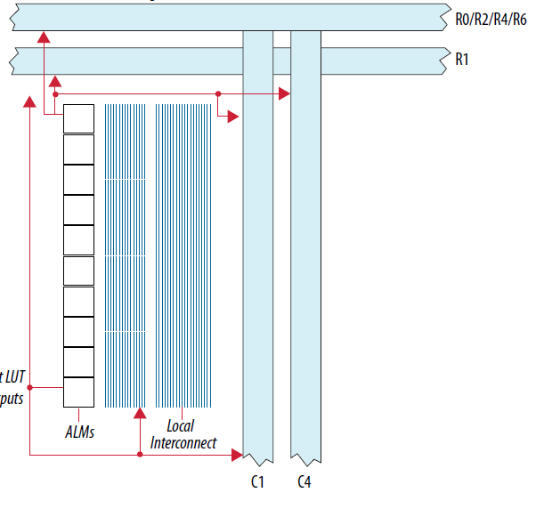

::: 

:::

---

## Hyperflex registers

- Simple D type flops are distributed through the routing for Agilex devices.
- These have CLK, D, Q only - remove resets where feasible.
  - I recommend you start with a no-reset mindset and add sync resets and async resets _only_ where needed to guarantee startup behaviour
- The Quartus Prime Pro software has an excellent retimer and diagnosis tools to push registers back.
- I recommend including a variable latency register back at the output of a module to allow you to easily increase latency and allow the fitter to push the registers back into your design
- The Technology Map viewer identifies the hyperflex registers by labelling them `HYPER`
- Turn on fast-forward in Synthesis settings or using `set_global_assignment -name FLOW_ENABLE_HYPER_RETIMER_FAST_FORWARD ON` for recommendations on how to reduce critical paths, and what the fmax _could_ be.

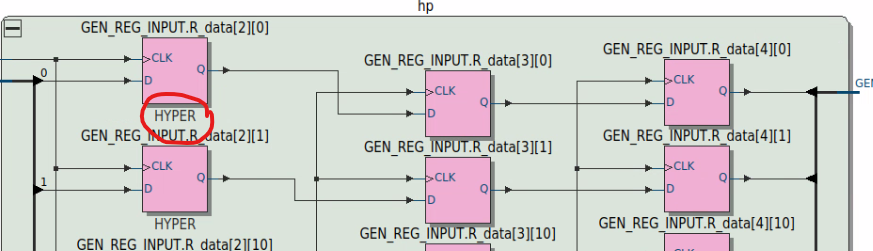{width=75%}

---

## RAM Basics

- Packed vs unpacked in verilog
  - LRM describes intent, but use packed for memory word width and unpacked for addresses.  
  - If you accidentally define your RAM with packed address dimensions, you will see a large increase in reg usage
- byte enables
  - 8 wide for 16, 32 bit data width
  - 5 wide for 10 bit data width
  - 10 wide for 20, 40 bit data width
- Mixed port combinations may be realised (eg write 32 bit wide, read 8 bit wide)
  - use 2 packed dimensions for this purpose eg `logic [3:0][7:0] the_mem [256]`

---

## RAM dual port

::: columns

::: column

- Dual port vs single port
  - Single port - one clock, read port and write port use the same clock.
  - Simple dual port - two clocks but still one read port, one write port.
  - True dual port - two clocks, read and write ports for each clock.
    **Agilex devices do not have native support for TDP RAMs, including them may impact your performance**
    eg for -6S speed grade; simple dual-port = 415MHz, true-dual-port = 335MHz - check [datasheet](https://docs.altera.com/r/docs/848370/current/agilextm-3-fpgas-and-socs-device-data-sheet)

:::

::: column

- Read during write

  - MLAB = undefined

  - M20K = old data

  - By default, the software will ignore read during write behaviour.  You can use `set_global_assignment -name STRICT_RAM_RECOGNITION ON` to 

  - Inferring new data behaviour can lead to extra bypass logic insertion

  - even with defined rdw behaviour, the `(* ramstyle = "no_rw_check" *)` attribute will remove extra passthrough logic.
    _Recommend an assertion that read during write doesn't occur if `no_rw_check` is in use_
    

:::

:::

---

## Inference recommendations for RAM/ROM

::: columns

::: column

- Right click on Quartus text editor and select Inset Template to get examples of inference patters that work
- Use examples from the classic [Advanced Synthesis Cookbook](https://github.com/thomasrussellmurphy/stx_cookbook)
- verify your low level building books map to hardware as you expect _before_ reusing them
- Assert on read during write in simulation and stay with Quartus Prime can infer RAM with don't-care rdw behaviour

:::

::: column

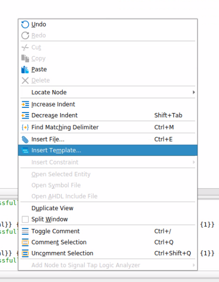

:::

:::

---

## Netlist viewers

::: columns

::: column

- Netlist viewers are available for multiple stages of compilation
- Elaborated = language extraction
- Swept = redundant logic removal
- Look at the **Compilation Dashboard** to see all available snapshots and netlist views

:::

::: column

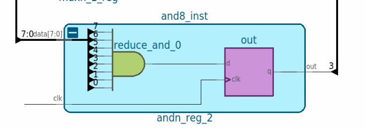{width=30%} 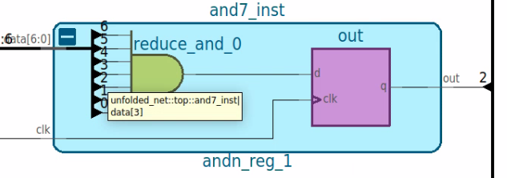

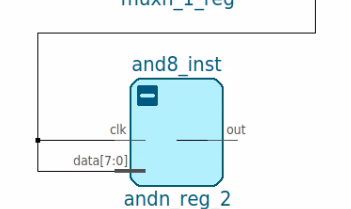{width=30%} 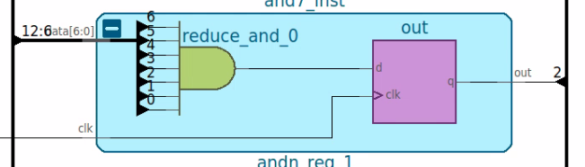

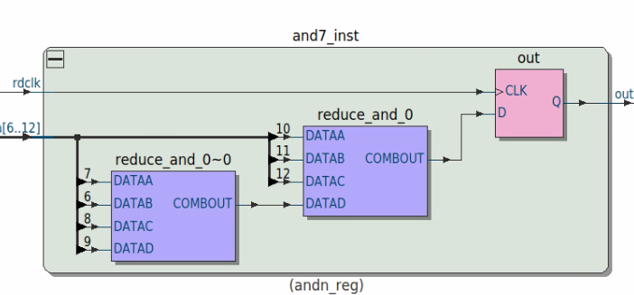{width=30%}

:::

:::

---

## RAM inference common mistakes

 - Accidental (or previously purposeful) true dual-port inference, when simple dual port would serve the functionality
 - packed / unpacked dimension confusion
 - unexpected read during write behaviour

---

## DSP / multiplier inference

::: columns

::: column

- latency
  - DSP blocks have input, output, 2xpipeline registers
    - 4 cycles latency when all registers are enabled
  - Not populating all registers impacts fmax
  - Retimer can retime registers through DSP blocks
- Data type
  - DSP blocks have native floating point support 
  - Using floating point types reduces fmax by ~18% 

- tensor mode
  - Agilex 5 introduces tensor mode - sum of products
    - FP16 and INT8 supported

:::

::: column

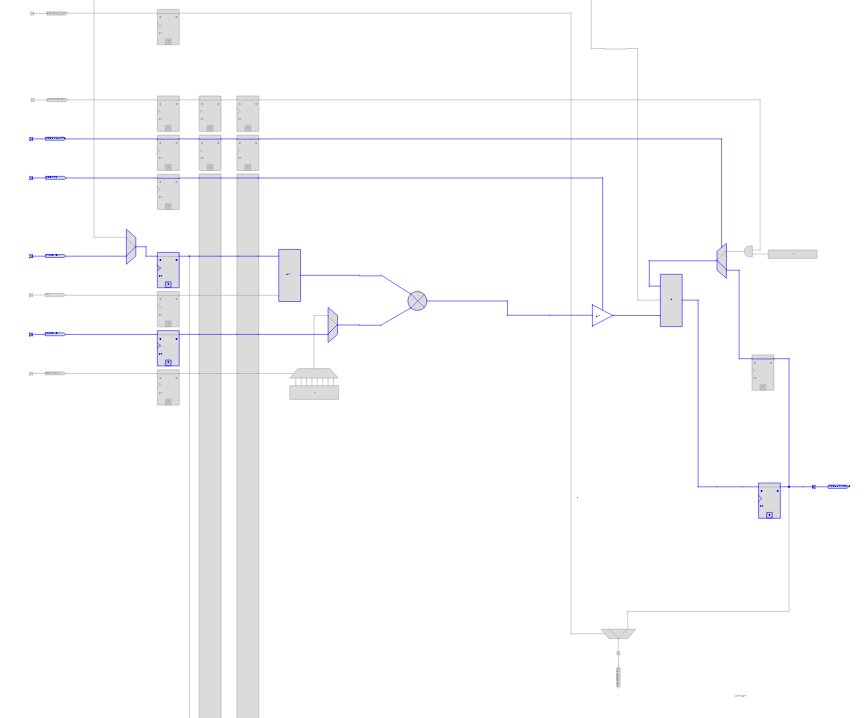

- Inference
  - some modes have complex inference models
  - Use **Insert template -> ... -> Arithmetic** as starting point

:::

:::

## Performance estimation

::: columns

::: column

- What's possible on real-life designs
  - [Agilex 7 SIMT soft processor](https://arxiv.org/abs/2504.07538) - 950MHz
  - [Agilex 7 FIR, FFT](https://docs.altera.com/api/khub/documents/QoDW7U8GgDJ15JLXgHKuKA/content?download=true&locationValue=search) - 560MHz FFT, 900MHz FIR
  - [Agilex 7 opencores](https://docs.altera.com/api/khub/documents/6wX2x6ZLq0X_Sx_Cetu8Xw/content?download=true&locationValue=search) - 380 - 800MHz
  - [Agilex 3 opencores](https://go.altera.com/altera-agilex3-certus-white-paper) - 250MHz - 350MHz
  - NB the opencores evaluations are performed on unmodified code - no optimization
- Check datasheets for upper limit

:::

::: column

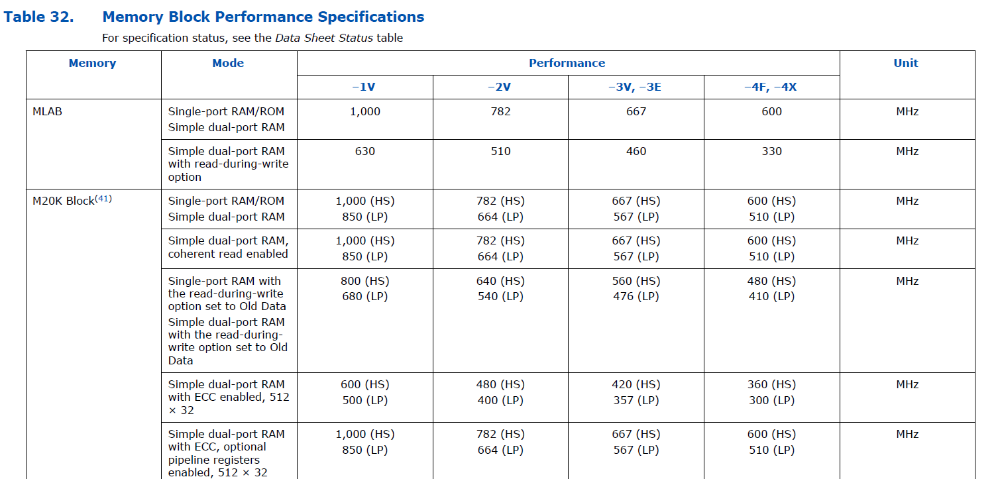

:::

:::

---

## Module level optimization

::: columns

::: {.column width=50%}

- Use assignments to reduce available resources to the fitter
  - `set_instance_assignment -name MAX_LABS` can be used to control number of LABS (=ALM*10)
  - `set_instance_assignment -name MAX_RAM_BLOCKS_M4K` can be used to control number of M20K BRAMs
  - `set_instance_assignment -name MAX_BALANCING_DSP_BLOCKS` can be used to control number of DSP blocks
  - The assignments may be applied to a module instance using `set_instance_assignment` or to the whole design using `set_global_assignment`

:::

::: {.column width=50%}

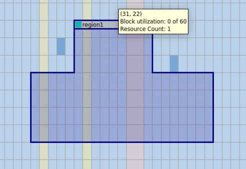

::: {.smaller}

- Use LogicLock to restrict usage to an area of the FPGA

  - **Assignments -> Logic Lock Regions Window** or **Tools -> Chip Planner** to draw regions 

  - Assign logic by design entry hierarchy or Design Partition

:::

:::

:::

---

