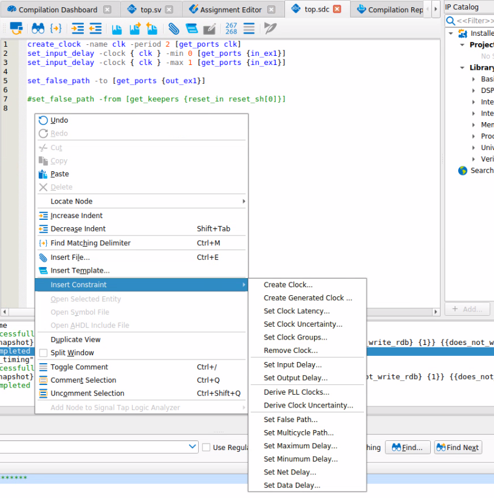

# Timing analysis and optimization

- Quartus provides tools to perform timing analysis and analyse critical paths
- Snapshots allow timing analysis and design visualization through the flow
  - Most easily accessed through the Compilation Dashboard
- Timing Analyzer
  - report on paths by clock and by path node
  - Visualize constraint waveform
- Chip Planner
  - Visualize physical placement and routing
- Technology map viewer / RTL viewer
  - schematic diagram of logic at each stage in the compilation flow

---

## Writing constraints

- The Quartus Prime Pro text editor includes an sdc constraint editor
  
- includes node finder to filter on names in your design
- If constraining to an internal node, remember to use `preserve`, `noprune` or `keep` to ensure a named node that you are attaching a constraint to is retained

---

## Synthesis only over-constrain

- As the fitter works on heuristics, a decision at placement may not be optimal and we may be able to see how to improve results on the finalised design.

- Old way (before Stratix 10 / Agilex)Use `$::TimingAnalyzerInfo(nameofexecutable)` to define constraints that are _not_ evaluated for sign-off

  - `set_max_delay` to encourage the fitter to place registers near to each other

  - ```
    # Example Fitter overconstraint targeting specific nodes
    if { $::TimingAnalyzerInfo(nameofexecutable) eq "quartus_fit"} {
      set_max_delay -from ${my_src_regs} -to ${my_dst_regs} 1ns
    }
    ```

- For hyperflex devices (Agilex, Stratix 10)

  - use `[is_post_route]` to affect placement but _not_ retiming.

  - ```
    # Example Fitter overconstraint targeting specific nodes (allows for post-route retiming)
    if { ! [is_post_route]} {
      set_max_delay -from ${my_src_regs} -to ${my_dst_regs} 1ns
    }
    ```

---

## Constraint principles

- A reminder on knowledge already familiar to people who have used sdc constraints
- Constraints do _not_ have any knowledge of your design, unless you use a multicycle exception, setup analysis is always on the destination latch edge following a launch edge and hold is on the destination latch edge preceding the one used for setup.
- Situations where you likely want to use `set_multicycle_path`
  - a PLL introduces a small positive offset in destination clock - by default the setup window may be vanishingly small
  - fast to slow or slow to fast transitions
- For clocks where all transfers are protected with some sort of metastable safe transfer `set_clock_groups` may be used to remove analysis between defined groups of clocks - but beware to check that all transfers really are protected.

---

## Constraint workflow

1. Define clocks with the maximum frequency that you require
   1. Compile design (only need to compile to stage `dni_synthesize`)
   2. Use Timing Analyzer to `Report Clocks`, `Report SDC`
2. Define IO constraints using `set_input_delay` and `set_output_delay`
   1. Compile design (only need to compile to stage `dni_synthesize`)
   2. Use Timing Analyzer to `Report Unconstrained Paths`
3. Define exceptions

---

## Design walkthrough

- switch to Quartus Prime Pro software

::: notes

Open pre-compiled design

Show compilation dashboard

Open Timing Analyzer from dashboard

Show how to Reset Design -> Create Timing Netlist -> read SDC

open an sdc file, create some constraints, show wild cards, node finder

Run a setup report

Report Timing - click the buttons but then do a hand edit to the generated command right before pressing OK

Explain -show_routing and different detail levels

Locate path in tech map viewer, chip planner.

Make a location assignment in Chip Planner

See the corresponding assignment in assignment editor

:::

---

## dual clock FIFO constraints

- A FIFO comprises a simple dual port memory, counters for read side and write side and comparison logic to calculate fill level and optionally disable writes or reads to prevent overflow
- If there are different read and write clocks, then the counters need to be transferred from one domain to the other.
- use gray coded counters + double register transfer
  - only one bit changes at a time so the value is either current - 1 clock or 2 clocks.
- old constraint methodology
  - use `set_false_path` as the transfer is double registered
  - but what if the skew across the vector is > one clock cycle?
  - On high utilization designs, these registers could be spread out _because_ the timing constraint has been removed
  - We have already seen that delays of >3ns are feasible even on a small device
- new constraint methodology
  - `set_max_skew` to ensure skew is < clk period
  - `set_max_delay` and `set_min_delay` to large values to effectively make skew the only constraint
  - Generate **IP Catalog -> FIFO IP** to see an example sdc 

---

## Metastability

- Enable auto identification of register chains and metastability analysis in **Assignments -> Settings -> Timing Analyzer**
- Define minimum MTBF per register chain in settings  - the default is 10^9 years which is very conservative, you should probably change to something more realistic for your application

---

## FSM processing

- Using `enum` types for state machines can separate intent from implementation and subsequently make changing encoding style easier
- You can use the `syn_encoding` attribute to control encoding as control how the FSM is encoded in hardware
  - `sequential` - binary
  - `safe`  - one-hot with protection logic - use if your state machine may enter invalid states (eg async reset)
  - `one-hot` - each state represented by one bit (two changes between any state)
  - `gray` - adjacent states differ by one bit, can represent 2^M states
  - `compact` - least bits to represent state
  - `johnson`  - adjacent states differ by one bit, can represent 2*M states, less logic than gray
- The **Synthesis > State Machines** report is useful for checking implementation
- By default, Quartus implements safe machines
  - The `set_global_assignment -name SAFE_STATE_MACHINE` can be set to `AUTO | ALWAYS | NEVER`
  - The `SAFE_STATE_MACHINE` assignment is still overridden by rtl attributes

