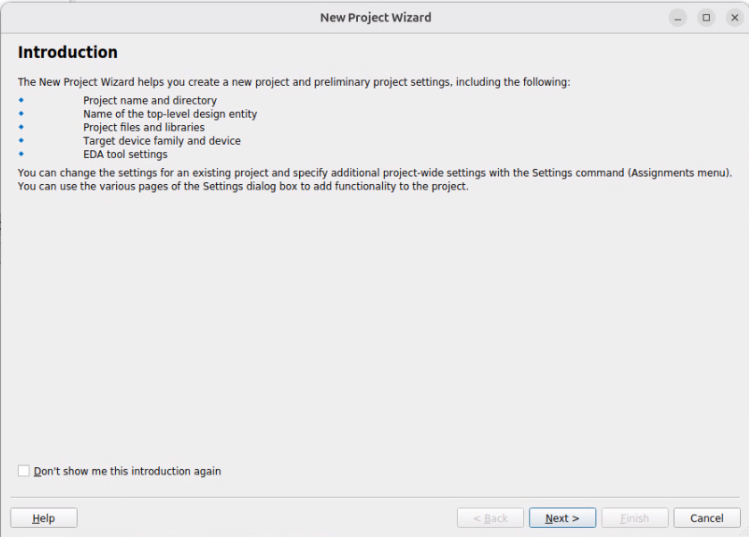
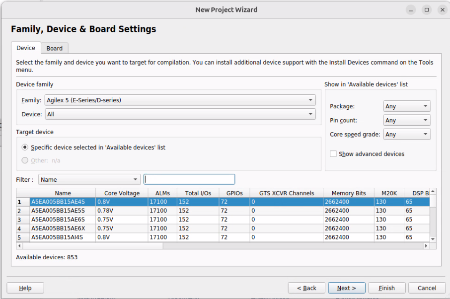
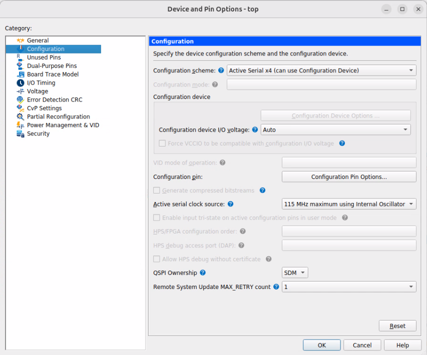
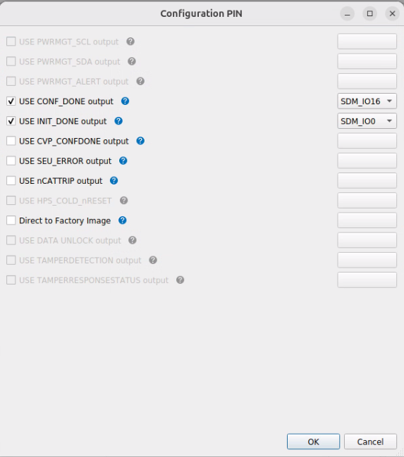
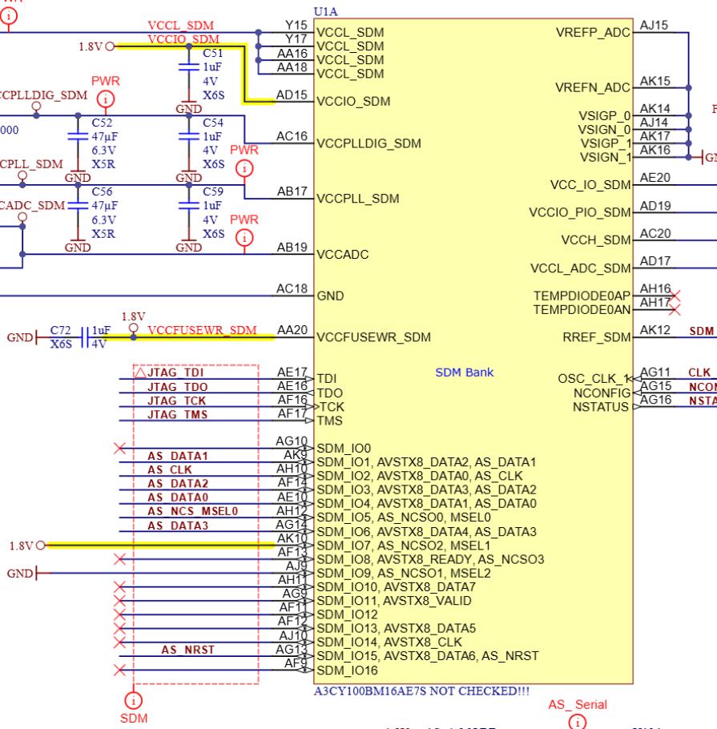
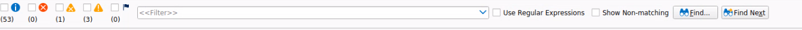
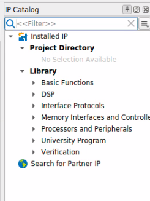

# Quartus Project Management Exercises

## Background

Create a project using Quartus Prime Pro design software.  Use a simple design specification to explore how the features work.

If you have spare time, try your own design sources.

For device specific settings, I have matched the Arrow/Trenz [AXC3000](https://www.hackster.io/MichalsTC/introduction-to-the-axc3000-9d204e).  Available from Arrow for < £100. 

## New project creation

Start the New project wizard by selecting **File -> New Project Wizard**



- Click **Next**

- Choose project location and name

  - Empty project
  - Working directory = `./work/` or alternate directory you choose
  - name of project? = `top`
  - name of top-level entity = `top`
  - when information is complete click **Next**

- Choose device

  - Choose Family = Agilex 3 (C series)
  - in the **Filter: Name** box type `A3CY100BM16AE7S` _Note that as you type, the list length reduces_
    - _Note_ we filter on Name here, but can filter on other columns.
  - Click Next

  

- Add Files

  - No files have been created yet, so click **Next**

- EDA Tool Settings

  - We won't use the Quartus software to generate simulation scripts so leave unchanged and select **Next**

- Summary

  - Inspect the summary information and then click **Finish**

## Device configuration settings

- Choose **Assignments -> Device** menu option
- Click **Device and Pin Options...**
- Select **Configuration** from **Category** panel

​	

- Retain **Active Serial x4** for use with QSPI configuration flash.

- Click **Configuration Pin Options** to configure the status pins for configuration.

  - tick **USE CONF_DONE output** then change the dropdown to **SDM_IO16**
  - tick **USE INIT_DONE output** and leave dropdown as **SDM_IO0**

  

  - You can check these pins against the schematics for the AXC3000 available from the [github page](https://github.com/ArrowElectronics/Agilex-3/wiki/Agilex-3-AXC3000-Development-Platform).  You should see that these are unconnected pins. 
    

  

  - Press **OK** on each window to accept the change to configuration options.

- Open the `top.qsf` file (either using **File -> Open ** or a text editor directly from your operating system).  Check that assignments have been added for the configuration pin usage.
  ```
  set_global_assignment -name USE_CONF_DONE SDM_IO16
  set_global_assignment -name USE_INIT_DONE SDM_IO0
  ```

  

## Create a new design


write rtl to implement the diagram above

- shift_reg is most significant bit received first
- conditional recorder must receive `0xBA` then `0xBE` to start recording
- memory records 512 values

You can choose to use the Quartus editor by choosing **File -> New** or to use your own favourite text editor.

There should be a module that matches the project name that you specified earlier ie `top`.

### Add design file(s) to project

If you use the Quartus editor to create your file, you may need to add the file to your project.  The Quartus software will read files that meet one of these criteria:

- Explicitly added to project using **Project -> Add/Remove Files in Project...**
- Included in the project directory
- Included in a library path specified at the beginning or using **Assignments -> Settings** and using the **Libraries** category

## Set compilation settings

- Open settings dialog **Assignments -> Settings** browse to **Compiler settings -> Verilog HDL input**
- Change from default Verilog-2001 to SystemVerilog-2012

### Synthesize

Run synthesis on your design

- tool 
- **Processing -> Start -> Start Analysis and Synthesis**
- Using **Compilation Dashboard** select **Processing -> Compilation Dashboard** if not already visible.

### Analyse results

You should already see compilation messages from the operation above.

Use the filters to identify errors, warnings and info messages:


Open the compilation report to read information on each stage:

- tool 
- **Processing -> Compilation Report**
- Look through each section of the report
- Use netlist viewers from **Compilation dashboard** or **Processing -> Netlist viewers** to check functionality has been inferred as you expect
- You will need to include read signals to prevent the RAM being optimised away

## Include Reset Release IP

_You can start this section either with the project you have created above or use [cmpl_proj_step1](./cmpl_proj_step1)_

The _Critical Warning_ says we need a Reset Release IP.  We need to use the IP Catalog to get this and all other Altera defined blocks:

- All primitives
- Signal processing IP (eg video, filter, transform)
- Interface (eg PCI Express, Ethernet)

The IP Catalog window is included by default.  If it has been switched off, it can be re-enabled using **Tools -> IP Catalog**



- Start typing `Reset Release IP` into the IP Filter box
- Double click Reset Release IP when the icon is visible
- Decide a name for the IP variant when the dialog box opens.  I use `rst_rel`
- click **Create**
- Choose **Reset Interface** _Note this selection doesn't matter for the rtl only project, the interface definition is used by Visual Designer Studio_
- Click **Block Symbol** to see the interface
- Click **Generate HDL...** to generate the HDL file
- Do not change from defaults and click **Generate**
- If prompted to save before generation choose **Yes**
- A window appears with the generation process.  Filters work in a similar way to the message window
- click **Close**
- click the x in the top right corner of the Reset Release IP window
- look in the working directory of your project to find `rst_rel.ip` and a directory called `rst_rel`
- Connect the `ninit_done` output of the reset release IP to the reset inputs of the logic you have designed.
- Run **Analysis & Synthesis** again
- Check that there are no warnings or errors in the Processing tab of the Message window

## Fitter flow

_You can start this section either with the project you have created above or use [cmpl_proj_step2](./cmpl_proj_step2)_

- Run the full compilation flow
  - Press the triangle tool 
  - **Processing -> Start Compilation**
  - Select **Compile Design** from **Compilation Dashboard**
- Inspect warnings
  - Pins are included without 
