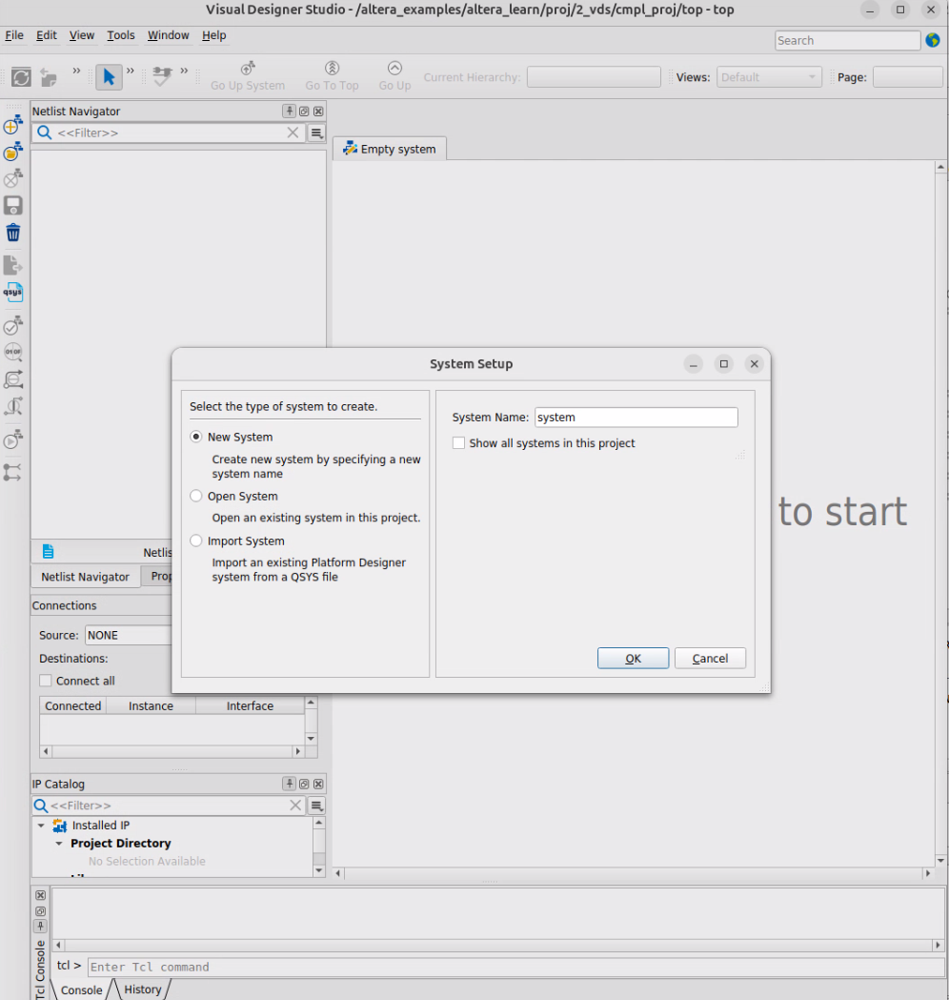
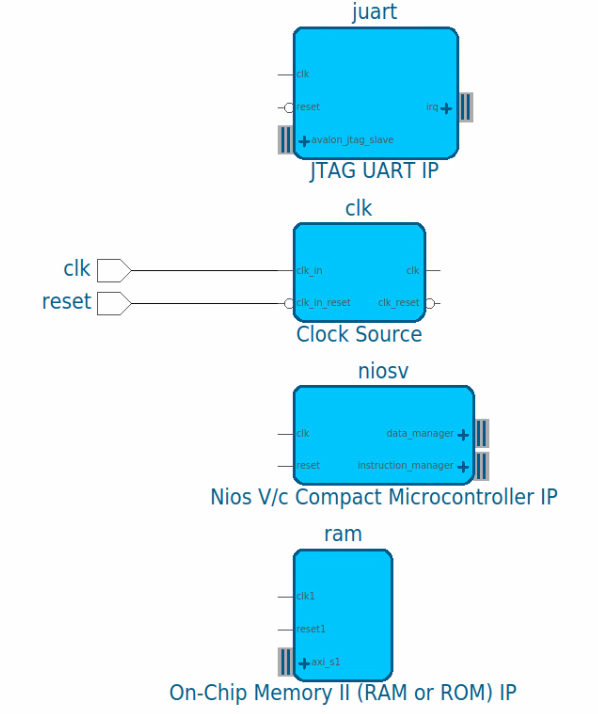
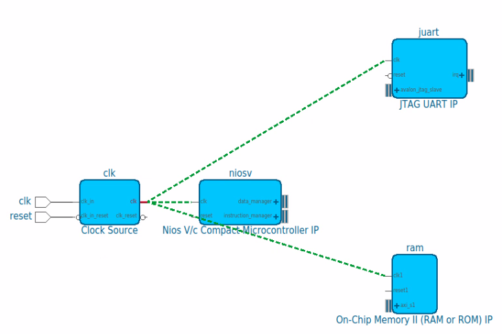
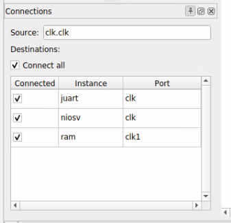
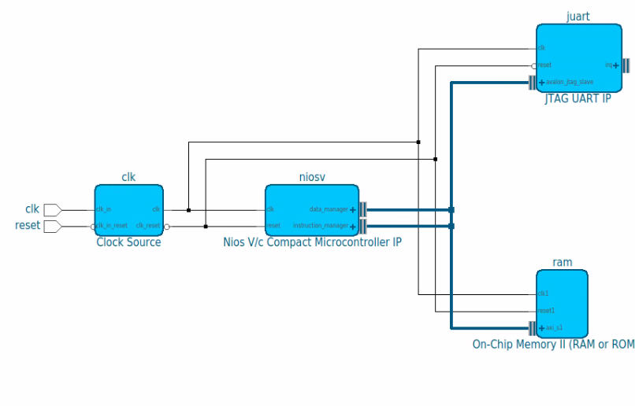
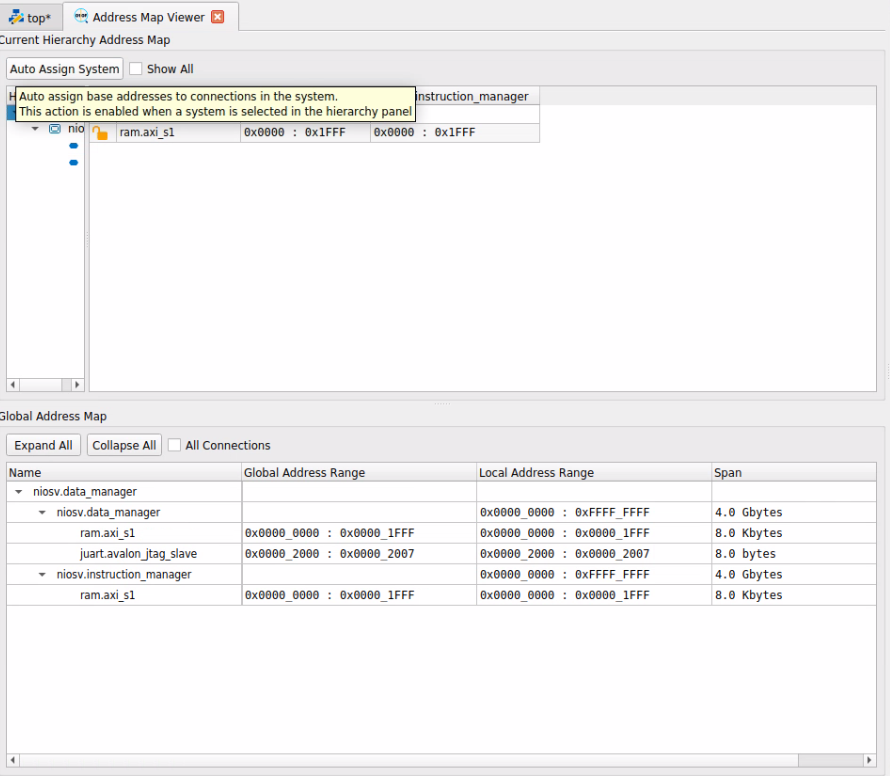
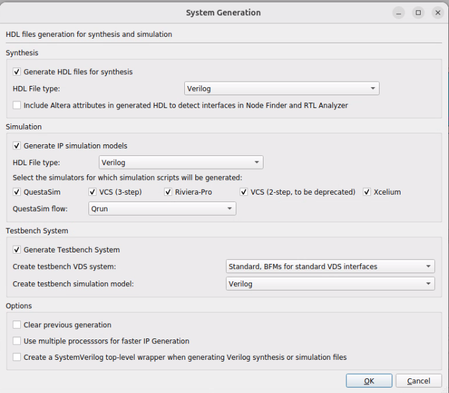
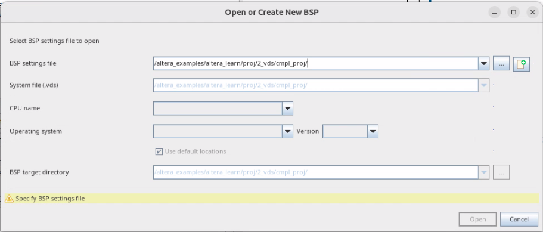
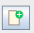

# Visual Designer Studion

## Background

Use Visual Designer Studion to create a simple system and compile the design ready to deploy

For device specific settings, I have matched the Arrow/Trenz [AXC3000](https://www.hackster.io/MichalsTC/introduction-to-the-axc3000-9d204e).  Available from Arrow for < £100. 

## New project creation

Device settings from introduction lab are the starting point, available here:  [cmpl_proj_step1](./cmpl_proj_step1).

## Visual Designer Studio

- Start Visual Designer Studio 
  
- Enter System Name: `top`
- Click **OK**
- IP Catalog is in an awkward place by default so move it across.

---

## System entry

- In IP Catalog tab

  - type nios, double click Nios V/c
  - In parameterization leave all settings except **Cell name** unchanged.  **Cell name** = niosv
  - Click **Finish**
    - A block appears on the canvas
  - Use ctrl+mouse wheel to zoom in or Fit in window / Fit selection in window 
    - or mouse strokes with left mouse button held down
      - up,left = zoom in
      - up,right = zoom out
      - down,right = zoom selection
      - down,left = zoom fit
  - 4 _interfaces_ are shown
    - clk
    - reset
    - data_manager - an axi4lite master
    - instruction_manager - an axi4lite master
  - Click the **+** next to data_manager and instruction_manager to see the signals in each interface
    - each interface is 32 bit
  - We will use a single memory for .text and .data: type `on chip mem` in the **Filter** and choose **On-Chip Memory II**
    - Interface = AXI-4
    - Type = RAM
    - Number of AXI interfaces = 1
    - Block type = AUTO
    - Disable Clock... = Disabled
    - Data width = 32
    - AXI Transaction ID Width = 2
    - Total memory size = 8192 bytes
    - Cell name = ram
    - All other boxes unchanged
  - type JTAG in **Filter** text box, then choose JTAG UART IP
    - cell name = juart
    - all other settings unchanged
  - type clock in **Filter** and choose Clock Source
    - cell name = clk
    - all other settings unchanged
  - The canvas should now have 4 blocks ready to connect up
    

- Drag the blocks to a convenient location

- Click the clk signal of the clk Clock Source - the possible connections are displayed in green
  

- In the Connections box, click Connect all
  

- Follow the same procedure for clk_reset and data_manager

- For instruction manager, tick the ram but not juart box (we don't want to fetch instructions from the uart)

- The finished system should look like:
  

- Now assign addresses: 

  - subordinates connected to the niosv.data_manager clash

  - Press **Auto Assign System** button

  - Addresses assigned so that they do not clash:
    

  - Check that ram.axi_s1 is 0x0, this is the reset vector that we chose when configuring the niosv block

  - Click Connectivity Designer  for Platform Designer / Qsys / SOPC Designer style connection view

  - Click Validate System 

  - Click Generate System

    - Tick Generate IP simulation models

    - Tick Generate Testbench System

      

  - Click **OK**

## Software BSP generation

The Nios V BSP generator can be run from VDS.  Go to **Tools -> BSP Eitor**

- BSP Settings file - choose to create new: 
  - Name = top.bsp
  - Leave Operating system as Altera HAL (ie baremetal), note you could have FreeRTOS too
  - Press **Create**
- The BSP editor allows you to select which Altera source files should be included 
  - Press **Generate BSP** without making modifications
- Start Ashling RiscFree IDE
- Choose **File -> New -> C/C++ Project**
- Choose **CMake Project**

## Simulation

- Start Questa Altera FPGA Edition  **NB latest version of Ubuntu supported = 20.04**
  - Later versions have incompatible gcc
- Navigate to `gen/vds/top_tb/sim/mentor` in your Quartus project directory
- `do msim_setup.tcl`
- `ld_debug`
- 

