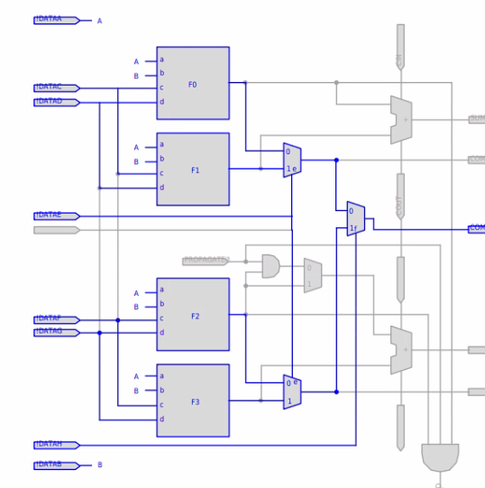

# Agilex hardware inference and optimization

## Inference patterns

- Open the `3_ram_dsp_alm/primitive_infer.qar` archive from the [proj](..) directory.

### Investigate logic removal

- Run Analysis and Synthesis 
- Inspect source file `top.sv` - note this design comprises
  - 5:1 mux
  - 8 input and
  - 7 input and
  - 6 input and
- Check Compilation Report 
  - Browse to **Synthesis -> Logic Synthesis Stage -> Partition "root_partition" -> Resource Utilization**
    - As expected 1 ALUT for 5:1 mux and and6
    - and7 requires 2xALUT
      - Expected  as only 6 inputs can participate in a general boolean equation, the remaining 2 may only be used as mux select inputs.
        
      - and8 is missing
  - Investigate reason for and8 removal
    - Navigate to **Analysis & Elaboration Stage -> Hierachies Optimized Away...**
    - Confirm and8_inst was optimized away during sweep
    - Use **Tools -> Netlist Viewers** to view the _Elaborated_ and _Swept_ netlists to identify the reason for removal
    - Inspect synthesis warnings for corresponding warning
  - Fix mistake in and8_inst and recompile
    - Check resource utilisation is as expected
  - Open **Technology Map Viewer** 
    - Expand and7_inst
    - Select the register and right click go to locate node and locate the register in
      - Chip Planner
      - Resource Property Viewer
      - Experiment with other views

### RAM inference

Open the `3_ram_dsp_alm/proj_ram/top.qpf` project

- Check settings 
  - Review Compiler Settings (including advanced settings)
    - Enable RTL analysis...
    - Enable Intermediate Fitter Snapshots
  - Check Hyperflex
    - Enable Run Fast Forward Timing Closure Recommendations
- Run full compilation
- Modify latency of RAMs (search for parameters named *LAT in `top.sv`)
  - Recompile and check affect on timing and fast-forward recommendations
- Modify `dc_sdp_ram_be` to be a true dual-port ram by adding an output port named `rddata_b` with the same dimensions as `rddata` and adding an assignment to that port in the `wrclk` `always_ff` block
  - recompile
  - observe change to fmax

## DSP inference

Open the `3_ram_dsp_alm/proj_dsp/top.qpf` project

- Run full compilation
  - Check timing report - expect fmax = 353MHz per the Agilex 3 datasheet
  - Compare technology map viewer (Synthesis) and (Final) chekcpoints
    - Note that the retimer has moved the bank of 5 registers back into the DSP block to switch on all available registers (input, output, 2xpipeline registers)
- Reduce `LATENCY` parameter from 5 to 1
  - Check timing report to see 

