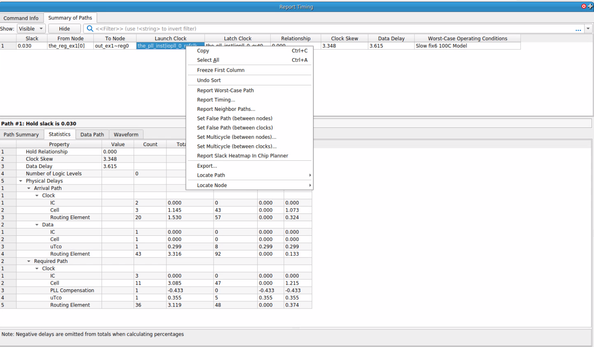
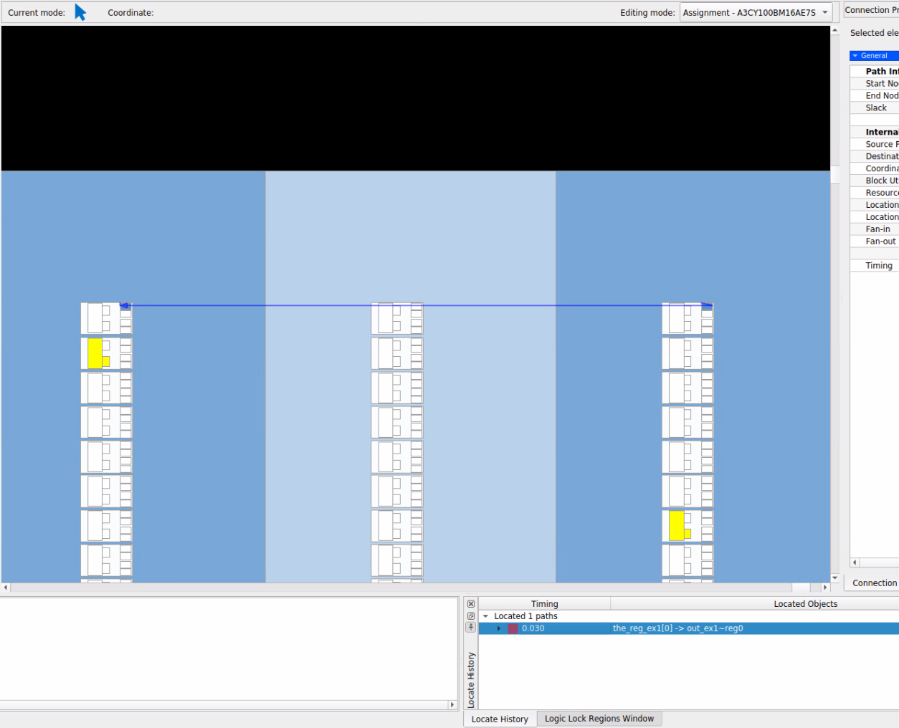
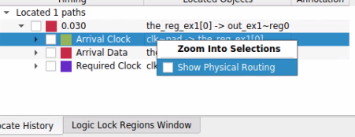
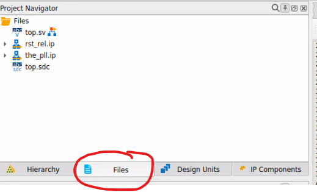
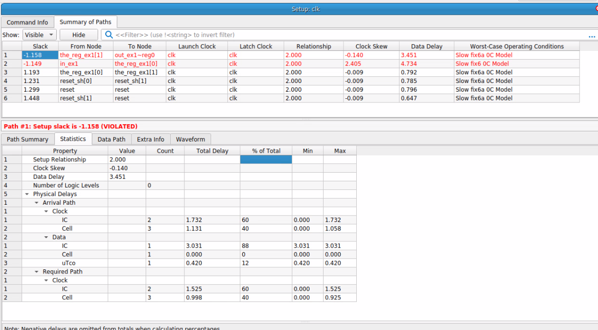

# Timing Analysis exercises

These exercises assume some familiarity with SDC constraints.

Further basic information on IO timing constraints can be found at the [Timing Analyzer Cookbook](https://docs.altera.com/r/docs/683081/22.2/quartus-prime-timing-analyzer-cookbook/quartus-prime-timing-analyzer-cookbook)

## Added hold timing

There are often times where the Quartus software has made decisions to meet timing according to your constraints and design, but one or both are not optimal.  This exercise uses an incorrectly configured PLL to illustrate.

- Open [hold_ex1](./hold_ex1)

- Run full compilation

- Review Timing Analyzer report **Compilation Report -> Timing Analyzer**

  - Confirm no violations

- Review **Fitter -> Route Stage -> Estimated Delay** report

  - identify paths that have added delay

- Analyse these paths in Timing Analyzer

  - Open Timing Analyzer 

  - Report timing on path identified above using **Report Timing...** Task

    - click **Show Routing** checkbox

    - Change **Report panel name** to something meaningful to you

    - Set Analysis type to **Hold**

    - Set **Targets -> To** to path of interest ie `[get_keepers out_ex1*]`

    - Press **OK**

    - Note command in tcl window: `report_timing -to [get_keepers out_ex1*] -hold -npaths 10 -extra_info none -detail full_path -show_routing -panel_name {Hold timing lab}`

    - Go to statistics tab, notice the smoking gun

      - clock skew
      - data delay

    - Cause and effect: Clock Skew -> Data Delay

    - Right click path in **Summary of Paths**
      

    - **Locate Path -> Chip Planner**

    - Double click the path in **Locate History**

      

    - Press the Expand Connections button: 

      - Get a feel for what 3ns looks like

    - Unfold the path in Locate History and right click on each segment to enable **Show Physical Routing**
      

- Return to Quartus Prime Pro window

- Navigate to Files Tab in Project Navigator
  

- Double click **the_pll.ip**
  - The **IP Parameter Editor opens**
  - Scroll down to **Compensation**
  - Change mode from **direct ** to **normal**
- Click **Generate HDL**
- Press **Generate**
- Run full compilation flow in Quartus Prime Pro Window.

## Setup path with pipelining opportunity

The placement constraints in this example are contrived, but we illustrate the point that physical constraints may cause the distance between registers to be long.

- Open [pipe_ex2](./pipe_ex2)
- Run full compilation
- Review Timing Analyzer report **Compilation Report -> Timing Analyzer**
  - Check Setup Summary - expect to see errors
- Right click error and choose **Report Timing...**
  
  - Is the problem Clock Skew or Data Delay?
  - Is the problem due to logic levels (contribute to cell delay), or interconnect
- Repeat command with `-show_routing` switch
- Return to Quartus Prime Pro Window and **Compilation Dashboard**
  - Run **Fast Forward Timing Closure Recommendations**
  - Open **Compilation Report** 
  - browse to **Fitter -> Fast Forward...**
  - Check Clock Fmax Summary
  - Check **Fast Forward Details**
- Implement fast forward hyper-retiming recommendations (as this is just a toy project, it's OK to just remove reset - the async clr)
  - recompile and check Timing Analysis result against fast-forward recommendation
- Implement hyper-pipelining recommendation
  - recompile and check Timing Analysis result against fast-forward recommendation

## Logic optimization

In this example we use the Quartus Prime Pro tools to identify a design flaw, what Quartus can fix with physical synthesis and where help is required.

- Open [count_ex3](./count_ex3)
- Run full compilation
- Review Timing Analyzer report **Compilation Report -> Timing Analyzer**
  - Note the setup report
  - Right click error and choose **Report Timing...**
    - Is the problem Clock Skew or Data Delay?
    - Is the problem IC or Cell delay?
    - Right click the top failing path and click **Locate Path... -> Locate in Technology Map Viewer**
- Return to Quartus Prime Pro Window and **Compilation Dashboard**
  - Run **Fast Forward Timing Closure Recommendations**
  - Open **Compilation Report** 
  - browse to **Fitter -> Fast Forward...**
  - Check Clock Fmax Summary
  - Check **Fast Forward Details**
- Compare post map with retimed results
  - Go to **Compilation Dashboard** and click the button for **Technology Map Viewer (Post Mapping)**
    
  - Go to **Compilation Dashboard** and click the button for **Technology Map Viewer (Final)**
  - Compare results
- Check fmax limit
  - Check longest adder chain (enter in tcl console):
    `report_timing -to_clock { clk } -from [get_keepers {count[0]*}] -to [get_keepers {count[23]*}] -setup -npaths 10 -extra_info none -detail full_path -panel_name {Setup: clk}`
  - Is there more slack on the adder path or the less-than compare path?
  - Right click adder path and choose 
    - **Locate Path -> Locate Path in Technology Map Viewer**
    - **Locate Path -> Locate Path in Chip Planner**
    - Note how the carry chain contributes to a low delay
- Remove the condition for wraparound `if (count < ((2**24) - 24'd1)) begin`
  - recompile
  - check Timing Analyzer for how the unrestricted fmax scales

